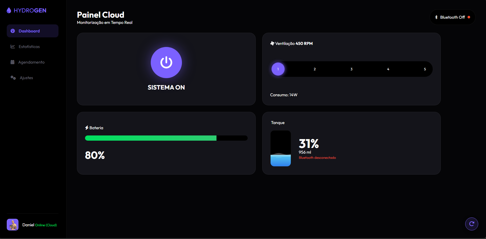
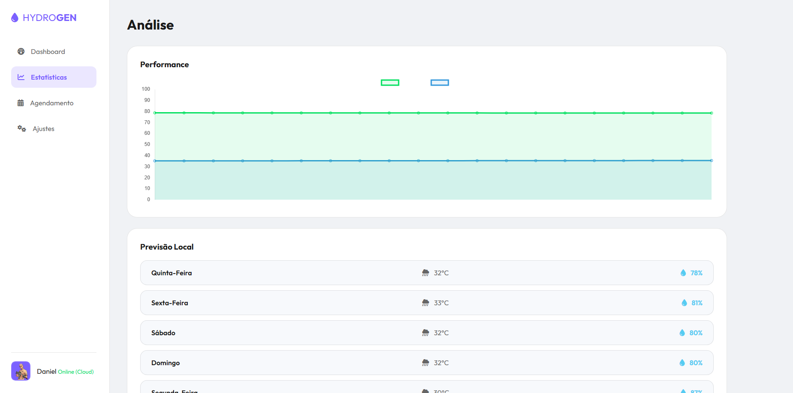
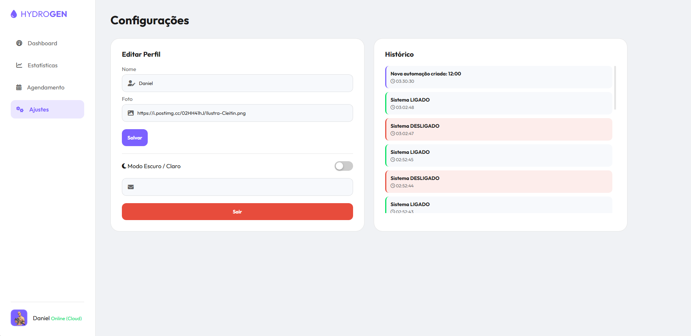

```markdown
# 💧 HydroGen Pro - IoT Cloud Dashboard

> Painel de controle web avançado para monitoramento, gestão e automação de sistemas de geração de hidrogênio em tempo real.

https://github.com/Danielzx1/Projeto_Tcc/blob/cdcfaa694b65d3b02ce128f5cc19fae8ef17277e/assets/preview.png


## 📋 Sobre o Projeto

O **HydroGen Pro** é uma aplicação web (SPA) desenvolvida para simular e controlar uma estação de hidrogênio via IoT. O projeto utiliza uma arquitetura moderna baseada em **Módulos ES6** e **Programação Orientada a Objetos (POO)**, garantindo um código limpo, escalável e de fácil manutenção.

O sistema conecta-se ao **Google Firebase** para sincronização de dados em tempo real entre múltiplos clientes e oferece ferramentas avançadas de análise e automação.

## 🚀 Funcionalidades Implementadas

### 📊 Monitoramento & Analytics
* **Sincronização em Tempo Real:** Status (Ligado/Desligado), Velocidade, Bateria e Nível de Água atualizados instantaneamente via Firebase Realtime Database.
* **Gráficos Dinâmicos:** Integração com **Chart.js** para visualização da performance do sistema (Bateria vs Água) minuto a minuto.
* **Simulação Física:** Módulo matemático (`SystemPhysics.js`) que calcula o consumo de recursos baseado na rotação (RPM) e tempo de uso.

### ⏰ Automação Inteligente
* **Agendamento Visual:** Interface customizada (Modal estilo Relógio) para criação de tarefas automáticas.
* **Modos de Operação:** Definição de horários para funcionamento em **Modo Econômico** (Verde) ou **Modo Turbo** (Vermelho).
* **Previsão do Tempo:** Consumo da API **Open-Meteo** para exibir dados climáticos locais, auxiliando na decisão de operação.

### 🎨 Interface & Experiência (UI/UX)
* **Temas Claro & Escuro:** Sistema de temas com persistência de preferência do usuário (salvo no LocalStorage).
* **Design Responsivo:** Layout adaptável que funciona perfeitamente em Desktops (Sidebar) e Mobile (Menu Inferior).
* **Glassmorphism:** Estilo visual moderno com transparências e blur.

### 🛡️ Segurança & Gestão
* **Autenticação Robusta:** Login e Registro com validação de senha e feedback visual.
* **Compliance LGPD:** Modal de consentimento de uso de dados e Checkbox obrigatório no cadastro.
* **Logs de Auditoria:** Histórico detalhado de todas as ações (quem ligou, quando alterou velocidade, reset de métricas).
* **Notificações:** Alertas nativos do navegador quando a bateria atinge níveis críticos (< 20%).

## 🛠️ Tecnologias Utilizadas

* **Front-end:** HTML5, CSS3 (Flexbox, Grid, CSS Variables), JavaScript (ES6 Modules).
* **Back-end (BaaS):** Google Firebase (Authentication & Realtime Database).
* **Bibliotecas:** * `Chart.js` (Gráficos).
    * `FontAwesome` (Ícones).
* **APIs Externas:** Open-Meteo (Clima).

## 📂 Arquitetura do Projeto

O código foi refatorado para seguir o padrão de **Separação de Responsabilidades (MVC-like)**:

```text
/
├── css/
│   ├── main.css          # Gerenciador de importações
│   ├── base.css          # Variáveis de Cores e Temas (Light/Dark)
│   ├── layout.css        # Estrutura Responsiva
│   └── components.css    # Estilos de Cards, Modais e Botões
├── js/
│   ├── main.js           # Ponto de entrada (Controller Principal)
│   ├── config/           # Configurações do Firebase
│   ├── models/           # Lógica de Negócio (Física do Sistema)
│   ├── services/         # Comunicação (Auth, Database, Log, Weather, Notification)
│   └── view/             # Manipulação do DOM (UI, Charts)
└── index.html            # Estrutura SPA

```

## 📸 Galeria

| Dashboard (Dark Mode) | Novo Agendamento (Modal) |
|:---:|:---:|
|   |   |

| Modo Claro (Light Mode) | Gráficos & Logs |
|:---:|:---:|
|  |  |

## 🔧 Como Rodar o Projeto

1. **Clone o repositório:**
```bash
git clone [https://github.com/SEU-USUARIO/hydrogen-pro.git](https://github.com/Danielzx1/hydrogen-pro.git)

```


2. **Abra o projeto:**
* Recomenda-se usar o **Live Server** do VS Code para evitar bloqueios de CORS nos Módulos ES6.


3. **Configuração:**
* O projeto já está configurado para conectar ao Firebase (verifique `js/config/firebaseConfig.js` se precisar alterar as chaves).


---

Desenvolvido por **[Daniel Oliveira Silva]** 💻

```


```

