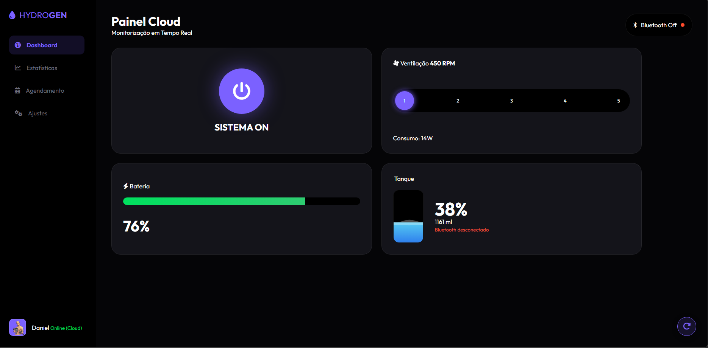


-----

````markdown
# 💧 HydroGen Pro - IoT Cloud Dashboard ⚡

> Painel de controle web avançado (PWA) para monitoramento térmico, gestão e automação de sistemas físicos via Bluetooth Low Energy (BLE) e nuvem em tempo real.



## 📋 Sobre o Projeto

O **HydroGen Pro** é uma aplicação web (SPA) desenvolvida para atuar como o "cérebro" de uma estação de hidrogênio e refrigeração. O projeto utiliza uma arquitetura moderna baseada em **Módulos ES6** e **Separação de Responsabilidades (MVC-like)**, garantindo escalabilidade e código limpo.

O grande diferencial do sistema é sua **Conexão Híbrida**: ele atua tanto no **Modo Demo** (simulação matemática de consumo de Joules e recursos) quanto no **Modo Real**, conectando-se diretamente a microcontroladores físicos usando a Web Bluetooth API nativa do navegador, com sincronização em nuvem via Google Firebase.

## 🚀 Funcionalidades Principais

### 📡 IoT & Comunicação
* **Web Bluetooth API:** Pareamento direto pelo navegador com o hardware físico (ex: ESP32) sem necessidade de aplicativos de terceiros.
* **Modo Híbrido:** Transição fluida entre simulação local (Modo Demo) e leitura de sensores físicos (Modo Real).

### 📊 Monitoramento & Analytics
* **Telemetria em Tempo Real:** Status, Consumo (Watts), Rotação (RPM) e Nível de Água atualizados instantaneamente via Firebase Realtime Database.
* **Gráficos Dinâmicos:** Integração com **Chart.js** para visualização da performance do sistema minuto a minuto.
* **Motor Físico Interno:** Módulo matemático (`SystemPhysics.js`) que simula o consumo real de uma bateria de 120Wh e evaporação de água com precisão.

### ⏰ Automação Inteligente & Clima
* **Agendamento Visual:** Interface customizada para criação de tarefas (Modo Econômico ou Turbo) executadas de forma autônoma.
* **Integração Meteorológica:** Previsão do tempo local usando a API Open-Meteo, contando com fallback inteligente caso o GPS seja bloqueado (Tracking Prevention).

### 🎨 Interface & Segurança (UI/UX)
* **Glassmorphism & Temas:** Estilo visual moderno com transparências, responsividade total e Temas Claro/Escuro (persistentes no LocalStorage).
* **Progressive Web App (PWA):** Instalável no celular e desktop, rodando em tela cheia como um app nativo.
* **Gestão de Acesso:** Login/Registro robusto (Firebase Auth), Modal de Compliance LGPD obrigatório e alertas nativos do navegador.
* **Modo Desenvolvedor (Logs):** Histórico de auditoria interno oculto para usuários comuns, visível apenas para contas de administração.

## 🧰 Especificações do Hardware (Protótipo Físico)

O painel foi calibrado para ler e calcular a física de componentes reais. Para a montagem do protótipo integrado, recomenda-se:
* **Microcontrolador:** ESP32 (NodeMCU) com suporte a BLE embutido.
* **Refrigeração:** Pastilha Peltier (TEC1-12706) 12V (~70W de pico).
* **Ventilação & Circulação:** Cooler 120mm PWM (Até 3200 RPM) e Mini Bomba Submersa 12V.
* **Alimentação:** Pack de Bateria LiFePO4 12V 10Ah (120Wh).

## 🛠️ Tecnologias Utilizadas

* **Front-end:** HTML5, CSS3 (Variáveis, Flexbox, Grid), JavaScript (Vanilla ES6+).
* **Back-end (BaaS):** Google Firebase (Auth & Realtime DB).
* **Bibliotecas:** Chart.js, FontAwesome.
* **APIs:** Web Bluetooth API, Geolocation API, Open-Meteo API.

## 📂 Arquitetura do Projeto

```text
/
├── css/
│   ├── main.css          # Gerenciador de importações globais
│   ├── base.css          # Variáveis de Cores e Temas (Light/Dark/Real Mode)
│   ├── layout.css        # Estrutura Responsiva
│   └── components.css    # Estilos de Cards, Modais e Botões
├── js/
│   ├── main.js           # Ponto de entrada (Controller Principal e Listeners)
│   ├── config/           # Credenciais da Nuvem
│   ├── models/           # Lógica de Negócio e Física do Sistema
│   ├── services/         # Comunicação (Auth, DB, Logger, Weather, BLE)
│   └── view/             # Manipulação isolada do DOM e Gráficos
├── manifest.json         # Configurações do PWA
├── sw.js                 # Service Worker (Cache e Offline)
└── index.html            # Estrutura da Single Page Application (SPA)
````

## 📸 Galeria

| Dashboard (Dark Mode) | Novo Agendamento (Modal) |
|:---:|:---:|
|  |  |

| Modo Claro (Light Mode) | Gráficos & Logs |
|:---:|:---:|
|  |  |

## 🔧 Como Rodar o Projeto

**Nota sobre Segurança:** Para testar a conexão Bluetooth e o GPS nativo, o navegador exige um contexto seguro. **Não é possível** testar a aplicação abrindo o arquivo `index.html` diretamente (via protocolo `file://`).

1.  **Clone o repositório:**
    ```bash
    git clone [https://github.com/Danielzx1/Projeto_Tcc.git](https://github.com/Danielzx1/Projeto_Tcc.git)
    ```
2.  **Inicie o Servidor:** Abra a pasta no VS Code e utilize a extensão **Live Server** (ou publique diretamente em uma host HTTPS, como Netlify).
3.  **Credenciais:** O projeto requer um banco de dados ativo. Substitua as chaves no arquivo `js/config/firebaseConfig.js` pelas do seu projeto no Firebase Console.

-----

Desenvolvido por **Daniel Oliveira Silva** 💻

